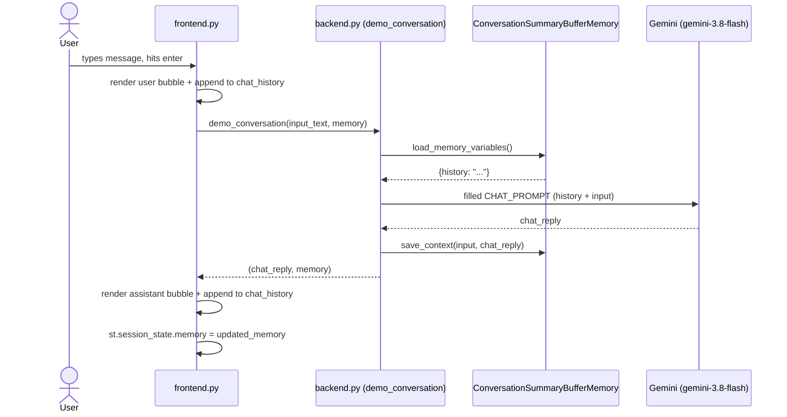

# 📌 Memory Chatbot

A Streamlit chatbot powered by Google Gemini and LangChain, with conversation memory that summarizes older turns to avoid context window blow-up.

## Architecture

- **[frontend.py](frontend.py)** — Streamlit UI. Renders chat bubbles, manages `st.session_state` (memory + display history), and calls into the backend on each user message.
- **[backend.py](backend.py)** — LangChain/Gemini logic. Builds the LLM client, conversation memory, prompt template, and runs each conversation turn. Not meant to be run directly (`streamlit run frontend.py` is the entry point).

## How it works

### Two separate "history" stores

1. **LLM memory** (`ConversationSummaryBufferMemory`, `memory_key="history"`) — drives what the model actually remembers. Recent turns are kept verbatim; once the buffer exceeds `max_token_limit=1000`, older turns are summarized by the LLM itself.
2. **UI chat history** (`st.session_state.chat_history`) — a simple list of `{"role", "text"}` dicts used only to redraw chat bubbles after Streamlit reruns the script. Cosmetic only — has no effect on what the model remembers.

### Request flow



1. User submits a message via `st.chat_input`.
2. Frontend immediately renders the user's bubble and appends it to `chat_history`.
3. Frontend calls `backend.demo_conversation(input_text, memory)`.
4. Backend builds a fresh Gemini client, wraps it with the existing `memory` and `CHAT_PROMPT` in a `ConversationChain`, and calls `.predict()`.
5. LangChain loads the current `history` from memory, fills the prompt, sends it to Gemini, and gets a reply.
6. The turn is saved back into memory (summarizing older turns if the token limit is exceeded).
7. Backend returns `(chat_reply, memory)`; errors are caught and returned as a friendly string instead of crashing.
8. Frontend renders the assistant's reply and persists the updated memory/chat history in `st.session_state` for the next rerun.

### "Clear Conversation" button

Resets both the LLM memory and the UI chat history, then forces an immediate rerun via `st.rerun()`.

## Setup

1. Create a `.env` file in the project root:
   ```
   GOOGLE_API_KEY=your_key_here
   ```
2. Install dependencies:
   ```powershell
   pip install -r requirements.txt
   ```
3. Run the app:
   ```powershell
   streamlit run frontend.py
   ```

## Notes

- Model is currently set to `gemini-3.8-flash` (`gemini-2.5-flash` was deprecated for new API keys as of this writing).
- `backend.py` is a library module only — running it directly with `streamlit run backend.py` renders a blank page since it has no `st.*` UI calls.

